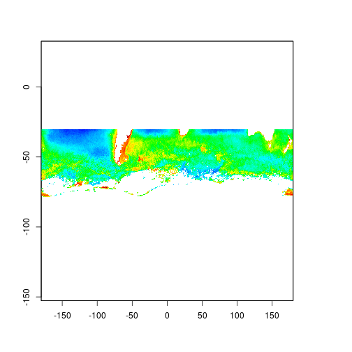
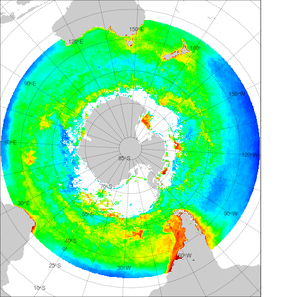

## R


```r
library(raadtools)
```

```
## Loading required package: raster
## Loading required package: sp
```

```
## [1] ""
```

```r
x <- chlafiles(product = "johnson")

files <- subset(x, date > as.POSIXct("2012-04-30"))
chla <- stack(files$fullname, varname = "chlorophyll", quick = TRUE)

mchla <- calc(chla, mean, na.rm = TRUE)
pal <- palr::chlPal(palette = TRUE)
plot(mchla, col = pal$cols, breaks = pal$breaks, legend = FALSE)
```

 

```r
## GDAL bindings
library(rgdal)
```

```
## rgdal: version: 1.0-4, (SVN revision 548)
##  Geospatial Data Abstraction Library extensions to R successfully loaded
##  Loaded GDAL runtime: GDAL 1.11.2, released 2015/02/10
##  Path to GDAL shared files: /usr/share/gdal/1.11
##  Loaded PROJ.4 runtime: Rel. 4.8.0, 6 March 2012, [PJ_VERSION: 480]
##  Path to PROJ.4 shared files: (autodetected)
##  Linking to sp version: 1.1-1
```

```r
prj <- "+proj=laea +lon_0=147 +ellps=WGS84 +lat_0=-90"

map <- projectRaster(mchla, crs = prj)
```

```
## Warning in rgdal::rawTransform(projfrom, projto, nrow(xy), xy[, 1], xy[, : 52 projected point(s) not finite
```

```r
par(mar = c(0, 0, 0, 0))
plot(map, col = pal$cols, breaks = pal$breaks, legend = FALSE, axes = FALSE)
#box(col = "white", lwd = 2)

cm <- spTransform(coastmap("world"), prj)
plot(cm, add = TRUE, border = NA, col = rgb(0, 0, 0, 0.2))
library(graticule)
g <- graticule(seq(-180, 165, by = 15), 
               seq(-85, 80, by = 15),
               ylim = c(-85, 80), 
               xlim = c(-180, 180), proj = prj)
labs <- graticule_labels(seq(-180, 150, by = 30), 
                         seq(-85, 50, by = 15),
                         xline = 0, yline = -35, proj = prj   )

plot(g, add = TRUE, lty = 3, col = rgb(0, 0, 0, 0.6))
text(labs, cex = 0.8, lab = parse(text = labs$lab), col = rgb(0, 0, 0, 0.6))
```

 
